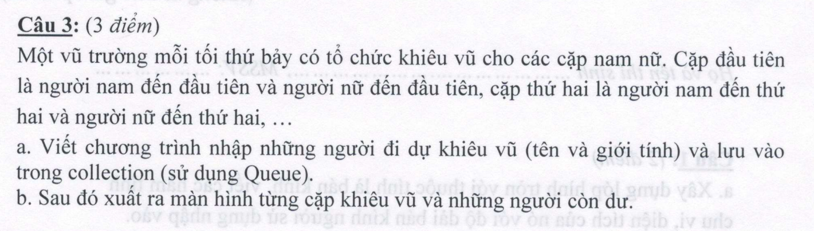
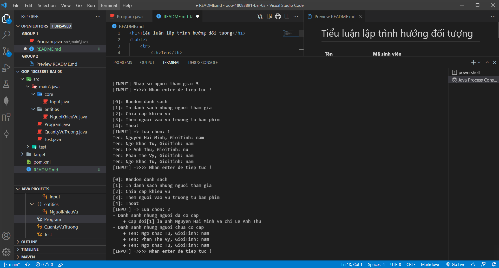

<h1 style="color: rgb(0, 255, 255);">Tiểu luận lập trình hướng đối tượng</h1>

    <table>
        <tr>
            <th>Tên</th>
            <th>Mã sinh viên</th>
        </tr>
        <tr>
            <td>Nguyễn Quốc Tuấn</td>
            <td>18083891</td>
        </tr>
    </table>

    <h2>Đề bài</h2>
    
    

    <h2>Hình minh họa</h2>
    

